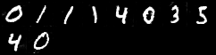
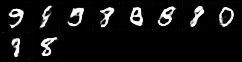
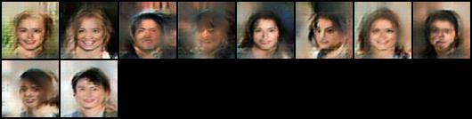
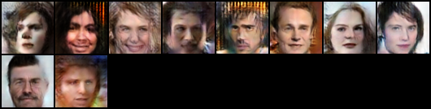
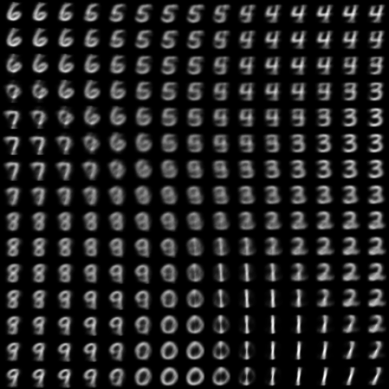

# Collection of generative models in pytorch

## dc-gan
Simple implementation of DCGAN [[Paper]](https://arxiv.org/abs/1511.06434), see also: [[cs231n]](http://cs231n.stanford.edu/)

`python train_dcgan.py`

MNIST Generation results after 15 epochs:

    

## wasserstein-gan
Pytorch implementation of the Wasserstein gan. [[Paper]](https://arxiv.org/abs/1701.07875)

`python train_wgan.py`

MNIST Generation results after 3000 iterations:

    

## vae-gan
Pytorch implementation of VAEGAN. [[Paper]](https://arxiv.org/abs/1512.09300)

`python train_vaegan.py --dataset-name CelebA --data-dir /path/to/noncropped/CelebA/`

CelebA generation after 1 epoch:

    

Cropped CelebA generation after 4 epochs:

    

## AAE
Adversarial Auto Encoder [[Paper]](https://arxiv.org/abs/1511.05644)

`python train_aae.py --model-type MNIST --dataset MNIST --epochs 10 --latent-size 2`

Latent manifold visualisation after 10 epochs:

    

